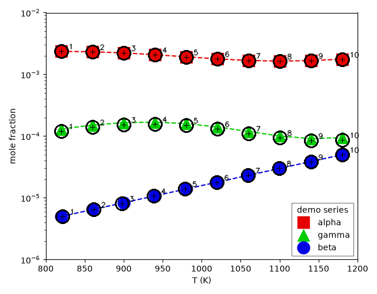

# HSV color-marker pipeline

A self-contained, **color-marker** digitizing pipeline that complements the main
`aidigitizer` (which is template/axis-detection + PyQt GUI based). Where a plot draws
each data series as a differently **coloured marker** (square / circle / triangle /
star / …) on top of same-colour fitted lines, this pipeline pulls the scatter points
out automatically by colour, strips the fused dashed lines, and places each point at
the marker's true geometric centre — then lets you audit and hand-correct everything.

It was built for combustion-kinetics validation figures (species mole-fraction vs
temperature, log-Y) and grew the two reviewers below. It shares this repo's philosophy:
**keep the raw image pixels as the source of truth, store human corrections as data,
make extraction reproducible.**



## What it does differently

| | main `aidigitizer` | this pipeline |
|---|---|---|
| find points | grayscale **template matching** | **HSV colour segmentation** per series |
| separate fitted lines | — | **morphological dash-stripping** (opening) |
| marker centre | template peak | **shape-aware**: circle-fit / triangle-centroid / opened-square bbox |
| config | interactive | **YAML** (`configs/plots.yaml`), many plots at once |
| corrections | `.aid.json` session | **`edits.json`** (overrides / manual / deleted), pixel-primary |
| review UI | PyQt GUI | **matplotlib** reviewer *and* a **browser/Canvas** reviewer |
| extra | — | **legend-swatch HSV sampler** to suggest colour ranges |

Both are honest about the same thing: auto-detection is an assistant, not magic. Points
stay editable and the pixel coordinates are kept so a digitization can be re-checked.

## Quick start

```bash
pip install -r hsv_pipeline/requirements.txt        # cv2, numpy, pyyaml, matplotlib
cd hsv_pipeline

python tools/make_demo.py            # regenerate the synthetic demo + calibrated config
python extract_points.py             # detect -> apply edits.json -> CSV + overlay
python review_points.py demo alpha   # matplotlib reviewer (fix points by hand)
python serve.py --plot demo          # browser reviewer at http://localhost:8000/
python sample_swatch.py              # suggest HSV ranges from the legend swatches
```

Outputs land in `extracted/` (git-ignored): one `demo_<series>.csv` (`T_K,mole_fraction`)
per series, plus `overlay_demo.png` for an eyeball check.

## Adding your own plot

Edit `configs/plots.yaml`: point `image_dir` at your image folder, give each plot its
axis calibration (linear X, log10 Y), the plot/legend rectangles in pixels, and per
species either explicit HSV `ranges` or a legend `swatch: [x, y]` to sample from.
`python sample_swatch.py` prints paste-ready `ranges:` for each legend colour.

## Data model

* **`Point`** lives in image pixels (`px, py`); data coords `(T, mole_fraction)` are
  derived through the calibration. You edit pixels (drag on the image); the calibration
  is the single source of truth for the mapping.
* **`edits.json`** holds only the human delta, keyed `plot → series`:
  `overrides` (nudged auto points, matched by id or nearest), `manual` (added points),
  `deleted` (auto ids). Re-running extraction re-applies them, so corrections survive.

## Browser reviewer keys

```
SELECT (default) click a point to select   ·   ADD (a) click to place a point
arrows move 0.5px/zoom · shift 5px   tab/shift+tab prev/next point (recenters)
◀ ▶ or , .  switch species   right-click / d delete · z undo · u restore auto
r  type exact T / mole-fraction      wheel/drag zoom/pan      s  save (+ regenerate CSV)
```

The move step follows WebPlotDigitizer: `step = base_px / zoom`, so zooming in gives
finer control. Saving writes `edits.json` and regenerates that plot's CSV + overlay.

## Files

```
hsv_pipeline/
├─ extract_core.py    # Point, detection (HSV + morphology + shape centres), CSV/overlay
├─ plot_config.py     # loads configs/plots.yaml -> PlotConfig
├─ edits_io.py        # read/write edits.json
├─ extract_points.py  # batch CLI: detect -> apply edits -> CSV + overlay
├─ review_points.py   # matplotlib reviewer
├─ serve.py           # stdlib http.server backend for the browser reviewer
├─ sample_swatch.py   # suggest HSV ranges from legend swatches
├─ web/               # browser/Canvas reviewer (index.html, app.js)
├─ configs/plots.yaml # per-plot calibration + colours (demo, generated)
├─ demo/demo_plot.png # synthetic demo image (generated, copyright-clean)
└─ tools/make_demo.py # regenerates the demo + its calibration
```

Requires Python ≥ 3.10. Licensed under this repository's MIT license.
